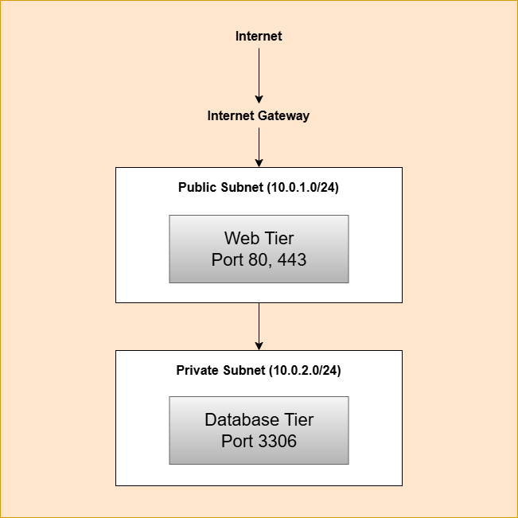

# Multi-Tier Cloud Architecture

Cloud infrastructure design demonstrating best practices for web application deployment on Oracle Cloud Infrastructure.

## 🏗️ Architecture Overview

This project demonstrates a production-ready multi-tier architecture design for cloud-based web applications.

### Architecture Components

**Network Layer:**
- Virtual Cloud Network (VCN): 10.0.0.0/16
- Internet Gateway for public connectivity
- NAT Gateway for private subnet outbound access
- Route tables for traffic management

**Public Subnet (10.0.1.0/24):**
- Web/Application tier
- Load balancer (future implementation)
- Bastion host for secure access
- Security list allowing HTTP (80), HTTPS (443), SSH (22)

**Private Subnet (10.0.2.0/24):**
- Database tier
- Application servers
- Backend services
- Security list restricting access to application tier only

**Security:**
- Network segmentation via subnets
- Security lists (stateful firewall)
- IAM policies for resource access
- Principle of least privilege

## 📸 Architecture Diagram

## 🛠️ Technologies

- **Platform:** Oracle Cloud Infrastructure (OCI)
- **Networking:** VCN, Subnets, Internet Gateway, Route Tables, Security Lists
- **Security:** IAM, Security Groups, Network ACLs
- **Design Patterns:** Multi-tier architecture, Network isolation

## 💡 Design Decisions

### Why Multi-Tier?

**Separation of Concerns:**
- Web tier handles user requests
- Application tier processes business logic
- Database tier manages data persistence

**Security:**
- Public subnet only exposes what's necessary
- Private subnet protects sensitive data
- Defense in depth through multiple security layers

**Scalability:**
- Each tier can scale independently
- Load balancing at web tier
- Database replication in data tier

**Maintainability:**
- Changes to one tier don't affect others
- Easier troubleshooting and monitoring
- Clear operational boundaries

## 📋 Implementation Experience

### Phase 1: Network Foundation
Created VCN with proper CIDR block allocation, ensuring room for future growth and multiple subnets.

### Phase 2: Subnet Design
Implemented public and private subnets with appropriate route tables and security rules.

### Phase 3: Security Configuration
Configured security lists following principle of least privilege:
- Public subnet: Only necessary ports exposed
- Private subnet: Access restricted to application tier
- No direct internet access to database tier

### Phase 4: Gateway Configuration
Set up Internet Gateway for public subnet connectivity and planned NAT Gateway for private subnet outbound access.

## 🎓 Key Learnings

- **Network Design:** Proper subnet sizing and CIDR allocation
- **Security Best Practices:** Network segmentation and access control
- **Cloud Networking:** Understanding virtual networks, routing, and gateways
- **Infrastructure Planning:** Designing for scalability and security from the start

## 🔄 Future Enhancements

- Add load balancer for high availability
- Implement auto-scaling groups
- Deploy actual application tiers
- Add monitoring and logging (OCI Monitoring, Log Analytics)
- Implement Infrastructure-as-Code with Terraform

## 📊 Architecture Benefits

**Availability:** Multiple availability domains for redundancy  
**Security:** Network isolation and controlled access  
**Scalability:** Each tier scales independently  
**Performance:** Optimized data flow between tiers  
**Cost:** Efficient resource utilization  

## 🔗 Related Projects

- [Terraform Infrastructure-as-Code](https://github.com/Ojuaos23/terraform-oci-infrastructure) - Automated version of this architecture
- [Cloud Portfolio](https://ojuaos23.github.io) - Live demonstration of cloud deployment

## 📧 Contact

- GitHub: [@Ojuaos23](https://github.com/Ojuaos23)
- LinkedIn: [Oluwatobi Ojuade](https://linkedin.com/in/oluwatobi-ojuade-9709ab343)
- Email: Tobi_Ojuade@yahoo.com
